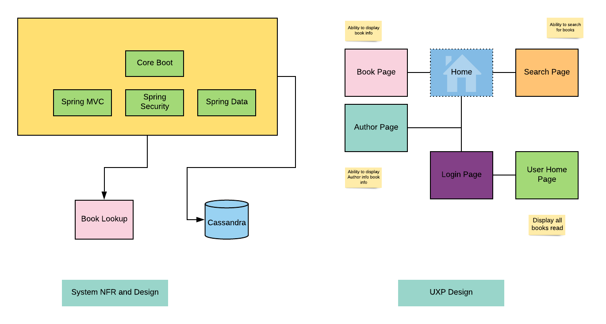

# upgraded-pancake

## My reader
This is an application developed as part of the code with me series

### Main application considerations

* Reliable application
* Performant
* No much for UI information - Descoped to Phase 2
* Big Data Scan and upload

### HLD System design and UXP

